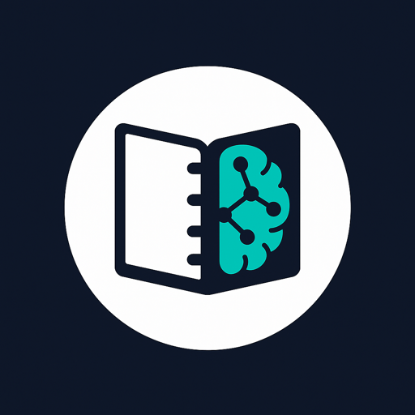
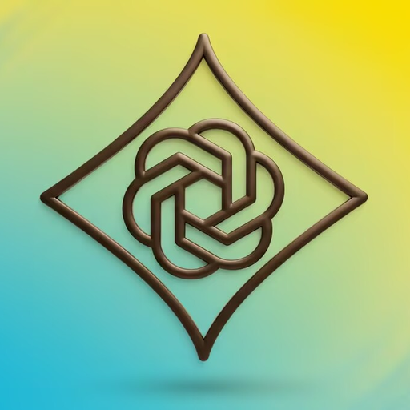

# Csikos Janos — Umbrel Community App Store

Add in Umbrel: **App Store → ⋯ → Community App Stores → Add** →
`https://github.com/csikosjanos/umbrel-app-store`

## Apps

| Logo | App | Description | Port |
|:---:|---|---|:---:|
|  | [GitHub Runner](./csikosjanos-github-runner/README.md) | Self-hosted GitHub Actions runners with a web UI | 9200 |
|  | [Chatterbox TTS](./csikosjanos-chatterbox-tts/README.md) | Text-to-speech with voice cloning (Resemble AI Chatterbox) | 8004 |
|  | [Qwen3-TTS](./csikosjanos-qwen3-tts/README.md) | Alibaba Qwen3-TTS text-to-speech (OpenAI-compatible REST API) | 4123 |
|  | [Open Notebook](./csikosjanos-open-notebook/README.md) | Self-hosted NotebookLM alternative for AI research | 8502 |
|  | [Promptfoo](./csikosjanos-promptfoo/README.md) | Test, compare and red-team your local Ollama models | 8010 |
|  | [CLIProxyAPI](./csikosjanos-cliproxyapi/README.md) | AI API proxy with System One passthrough and CPAMC web console | 8317 |
|  | [Ollama Model Manager](./csikosjanos-ollama-model-manager/README.md) | Manage Ollama models: loaded/unload, details, pull from library or Hugging Face | 11435 |
|  | [Laya System One](./csikosjanos-laya/README.md) | Self-hosted System One decision model, TypeSafe Jev-compatible API | 8720 |
|  | [Firstmate](./csikosjanos-firstmate/README.md) | One agent, a crew of coders: firstmate in tmux in the browser, with a settings UI | 3777 |

Logo → upstream project · App name → app docs (config, env vars, details)
